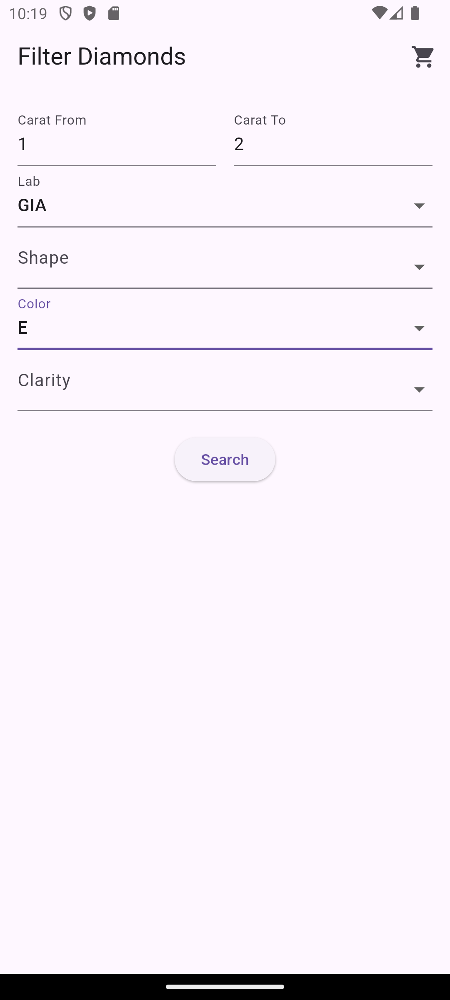
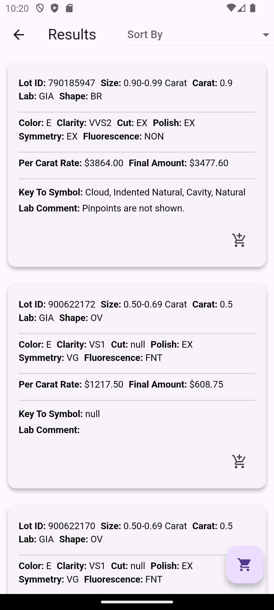
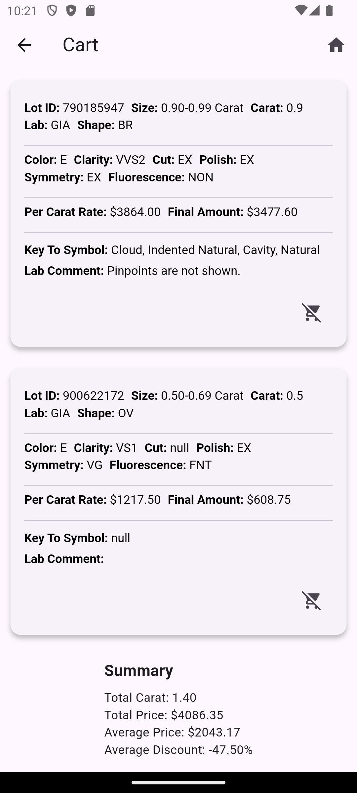
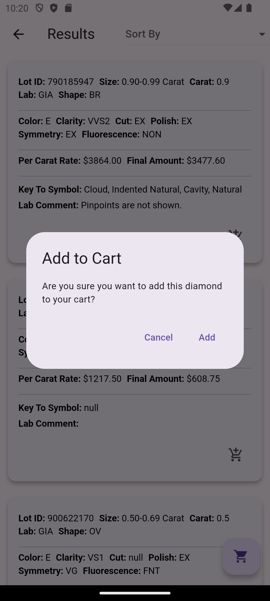
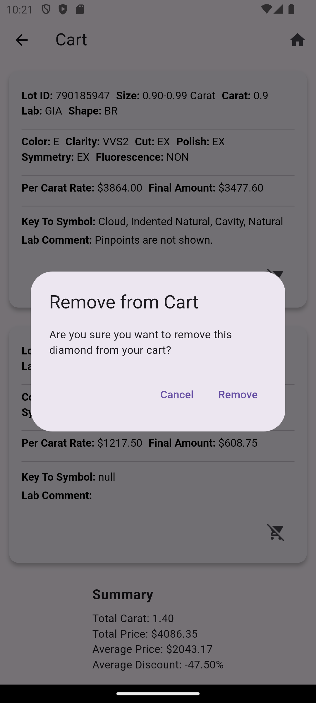

---

# Diamond App

This Flutter app allows users to filter, sort, and manage a list of diamonds. It includes features like filtering by carat, lab, shape, color, and clarity, as well as adding/removing diamonds to/from a cart. The cart data is persisted across app restarts using `SharedPreferences`.

---

## Project Structure

```
lib/
├── bloc/
│   ├── diamond_bloc.dart       # BLoC for managing diamond state
│   ├── diamond_event.dart      # Events for the BLoC
│   ├── diamond_state.dart      # States for the BLoC
├── models/
│   ├── diamond_model.dart      # Diamond data model
├── pages/
│   ├── filter_page.dart        # Page for filtering diamonds
│   ├── result_page.dart        # Page for displaying filtered results
│   ├── cart_page.dart          # Page for managing the cart
├── utils/
│   ├── excel_helper.dart       # Helper for reading Excel data
│   ├── localStorage.dart       # Helper for persistent storage
├── widgets/
│   ├── diamond_card.dart       # Reusable widget for displaying diamond details
│   ├── move_to_cart_button.dart # Reusable widget for navigating to the cart
├── main.dart                   # Entry point of the app
```

---

## State Management Logic

The app uses the **BLoC (Business Logic Component)** pattern for state management. Here's how it
works:

### Events

- `LoadDiamonds`: Loads diamonds from the Excel file.
- `FilterDiamonds`: Filters diamonds based on user input (carat, lab, shape, color, clarity).
- `UpdateFilters`: Updates the filter variables in the BLoC.
- `UpdateSorting`: Updates the sorting variables (sort by final price or carat weight, ascending or
  descending).
- `AddToCart`: Adds a diamond to the cart.
- `RemoveFromCart`: Removes a diamond from the cart.
- `SortDiamonds`: Sorts diamonds by final price or carat weight.

### States

- `DiamondInitial`: Initial state.
- `DiamondLoading`: State when data is being loaded.
- `DiamondLoaded`: State when data is successfully loaded. Contains:
    - `diamonds`: The full list of diamonds.
    - `cart`: The list of diamonds in the cart.
    - Filter and sorting variables (`minCarat`, `maxCarat`, `lab`, `shape`, `color`, `clarity`,
      `sortBy`, `isAscending`).
- `DiamondError`: State when an error occurs.

### BLoC

- The `DiamondBloc` handles all events and emits the appropriate state.
- It maintains three lists:
    - `diamonds`: The full list of diamonds.
    - `filteredDiamonds`: The list of diamonds after applying filters.
    - `cart`: The list of diamonds added to the cart.
- It also manages filter and sorting variables.

---

## Persistent Storage Usage

The app uses `SharedPreferences` to persist the cart data across app restarts. Here's how it works:

### Saving Cart

- When a diamond is added to or removed from the cart, the `LocalStorage.saveCart` method is called.
- The `Diamond` objects are serialized to JSON strings using `jsonEncode` and stored in
  `SharedPreferences`.

### Loading Cart

- When the app starts, the `LocalStorage.loadCart` method is called to load the cart data from
  `SharedPreferences`.
- The JSON strings are deserialized back to `Diamond` objects using `jsonDecode`.

### LocalStorage Class

- Provides methods for saving and loading the cart data.
- Uses the `_cartKey` to identify the cart data in `SharedPreferences`.

---

## Features

### Filter Page

- Allows users to filter diamonds by:
    - Carat range (min and max).
    - Lab.
    - Shape.
    - Color.
    - Clarity.
- Displays a list of filtered diamonds with an **"Add to Cart"** button for each diamond.

### Result Page

- Displays the filtered diamonds.
- Allows users to sort diamonds by:
    - Final Price (Ascending/Descending).
    - Carat Weight (Ascending/Descending).
- Includes a **"Move to Cart"** button to navigate to the cart.

### Cart Page

- Displays all diamonds added to the cart.
- Allows users to remove diamonds from the cart.
- Shows a summary of the cart, including:
    - Total Carat.
    - Total Price.
    - Average Price.
    - Average Discount.
- Persists cart data across app restarts.

---

## How to Run the App

1. Clone the repository.
2. Run `flutter pub get` to install dependencies.
3. Place the `Flutter-test-dataset.xlsx` file in the `assets` folder.
4. Run the app using `flutter run`.

---

## Dependencies

- `flutter_bloc`: For state management.
- `shared_preferences`: For persistent storage.
- `excel`: For reading Excel files.

---

## Screenshots

### Filter Page



### Result Page



### Cart Page



### Add Diamond Cart Page



### Remove Diamond Cart Page



---

## Future Improvements

1. **Search Functionality**: Add a search bar to filter diamonds by lot ID or other attributes.
2. **Pagination**: Implement pagination for large datasets.
3. **Advanced Filters**: Add more advanced filters like fluorescence, cut, polish, and symmetry.
4. **Theming**: Add support for light and dark themes.

---
